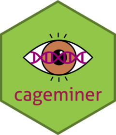

<!-- README.md is generated from README.Rmd. Please edit that file -->

# cageminer 

<!-- badges: start -->

[](https://lifecycle.r-lib.org/articles/stages.html#experimental)
[](https://github.com/almeidasilvaf/cageminer/actions)
<!-- badges: end -->

The goal of `cageminer` is to integrate SNP data from GWAS results with
gene coexpression networks to identify high-confidence candidate genes
involved in a particular phenotype.

## Installation instructions

Get the latest stable `R` release from
[CRAN](http://cran.r-project.org/). Then install `cageminer` using from
[Bioconductor](http://bioconductor.org/) the following code:

``` r
if (!requireNamespace("BiocManager", quietly = TRUE)) {
    install.packages("BiocManager")
}

BiocManager::install("cageminer")
```

And the development version from
[GitHub](https://github.com/almeidasilvaf/cageminer) with:

``` r
BiocManager::install("almeidasilvaf/cageminer")
```

## Code of Conduct

Please note that the `cageminer` project is released with a [Contributor
Code of Conduct](http://bioconductor.org/about/code-of-conduct/). By
contributing to this project, you agree to abide by its terms.

## Development tools

-   Continuous code testing is possible thanks to [GitHub
    actions](https://www.tidyverse.org/blog/2020/04/usethis-1-6-0/)
    through *[usethis](https://CRAN.R-project.org/package=usethis)*,
    *[remotes](https://CRAN.R-project.org/package=remotes)*, and
    *[rcmdcheck](https://CRAN.R-project.org/package=rcmdcheck)*
    customized to use [Bioconductor’s docker
    containers](https://www.bioconductor.org/help/docker/) and
    *[BiocCheck](https://bioconductor.org/packages/3.13/BiocCheck)*.
-   Code coverage assessment is possible thanks to
    [codecov](https://codecov.io/gh) and
    *[covr](https://CRAN.R-project.org/package=covr)*.
-   The [documentation
    website](http://almeidasilvaf.github.io/cageminer) is automatically
    updated thanks to
    *[pkgdown](https://CRAN.R-project.org/package=pkgdown)*.
-   The code is styled automatically thanks to
    *[styler](https://CRAN.R-project.org/package=styler)*.
-   The documentation is formatted thanks to
    *[devtools](https://CRAN.R-project.org/package=devtools)* and
    *[roxygen2](https://CRAN.R-project.org/package=roxygen2)*.

For more details, check the `dev` directory.

This package was developed using
*[biocthis](https://bioconductor.org/packages/3.13/biocthis)*.
